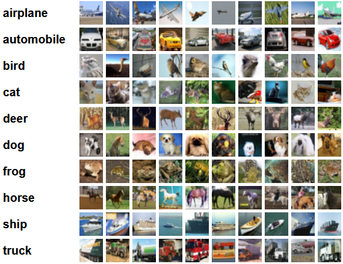

# Множественная классификация объектов

Датасет [CIFAR-10](https://www.cs.toronto.edu/~kriz/cifar.html)

[Ссылка на код решения на Каггле](https://www.kaggle.com/anastasiiasemina1/resnet)

10 классов со случайными представителями:

Aрхитектура ResNet

Гипперпараметры:
- оптимайзер: SGD
- lr: 0.01
- epoch: 10
- batch: 16

## Результаты обучения

| Accuracy | Precision | Recall | F1 |
|----------|-----------|--------|----|
|          |           |        |    |

Метрики по классам:

| Class | Accuracy | Precision | Recall | F1 |
|-------|----------|-----------|--------|----|
| plane |          |           |        |    |
| car   |          |           |        |    |
| bird  |          |           |        |    |
| cat   |          |           |        |    |
| deer  |          |           |        |    |
| dog   |          |           |        |    |
| frog  |          |           |        |    |
| horse |          |           |        |    |
| ship  |          |           |        |    |
| truck |          |           |        |    |

[//]: # (График лосс функции в процессе обучения)

[//]: # (График метрик на валидационной выборке во время обучения)

[//]: # (5-10 примеров изображений с результатом работы сети)
