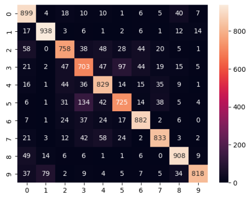
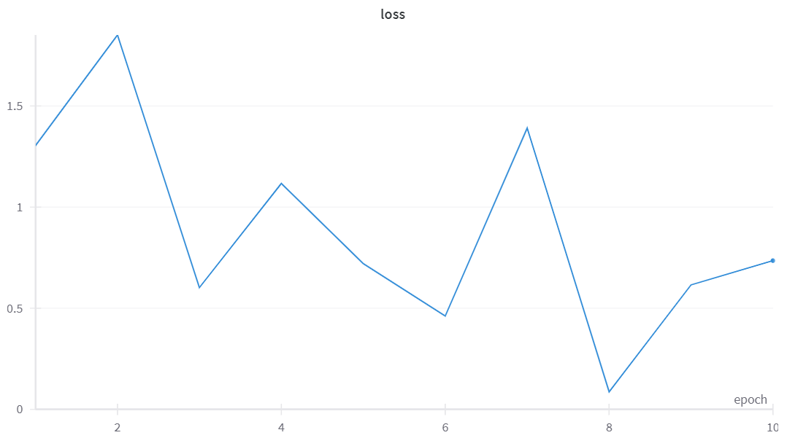
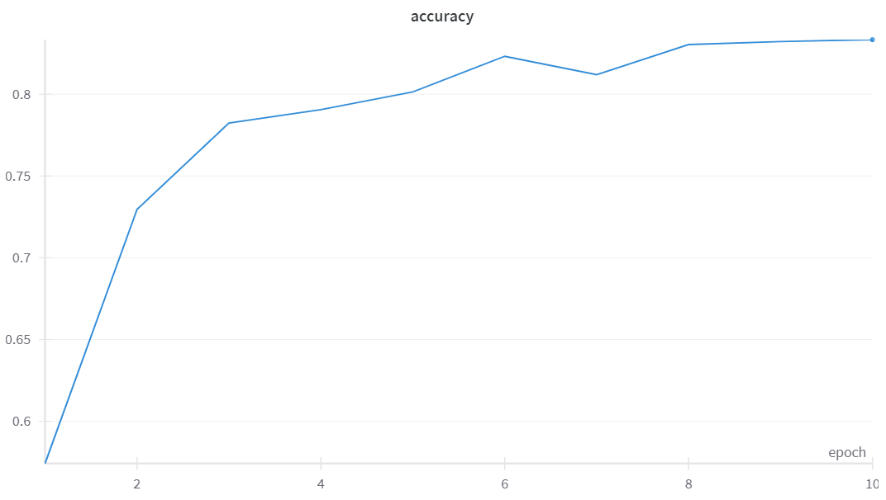
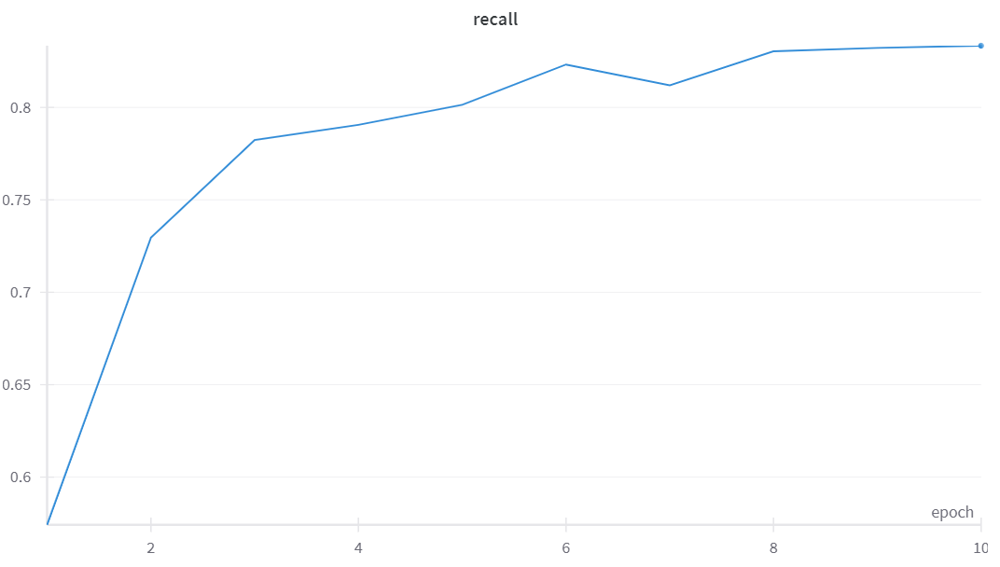
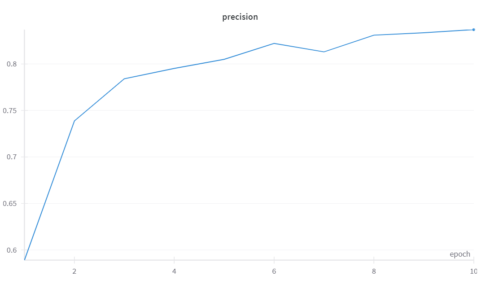
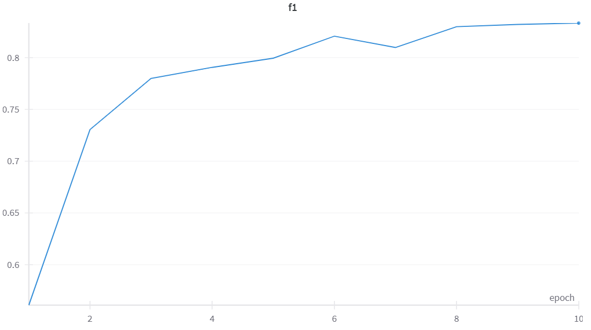
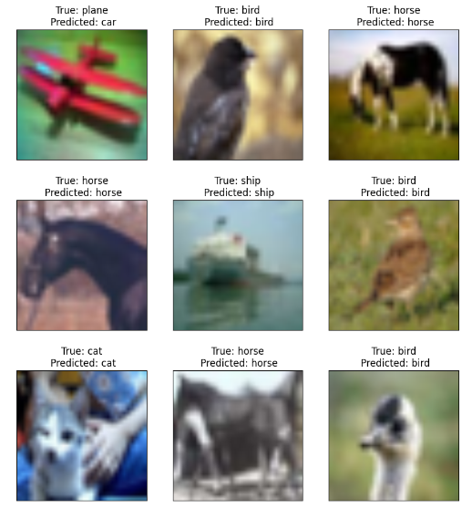

# Множественная классификация объектов

Датасет [CIFAR-10](https://www.cs.toronto.edu/~kriz/cifar.html)

[Ссылка на код решения на Каггле](https://www.kaggle.com/anastasiiasemina1/resnet)

10 классов со случайными представителями:

Aрхитектура ResNet

Гиперпараметры:
- оптимайзер: SGD
- epoch: 10
- lr: 0.01
- momentum: 0.9
- weight_decay: 0.001
- batch: 64
- levels (ResNet): [3, 4, 6, 3]

## Результаты обучения

| Accuracy | Precision | Recall | F1   |
|----------|-----------|--------|------|
| 0.83     | 0.83      | 0.83   | 0.83 |

#### Метрики по классам:

| Label | Class | Accuracy | Precision | Recall | F1   |
|-------|-------|----------|-----------|--------|------|
| 0     | plane | 0.90     | 0.79      | 0.90   | 0.84 |
| 1     | car   | 0.94     | 0.90      | 0.94   | 0.92 |
| 2     | bird  | 0.76     | 0.80      | 0.76   | 0.78 |
| 3     | cat   | 0.70     | 0.69      | 0.70   | 0.70 |
| 4     | deer  | 0.83     | 0.78      | 0.83   | 0.80 |   
| 5     | dog   | 0.73     | 0.79      | 0.72   | 0.76 |
| 6     | frog  | 0.88     | 0.86      | 0.88   | 0.87 |
| 7     | horse | 0.83     | 0.87      | 0.83   | 0.85 |
| 8     | ship  | 0.91     | 0.88      | 0.91   | 0.89 |   
| 9     | truck | 0.82     | 0.95      | 0.82   | 0.88 |

#### Confusion matrix:

#### График лосс-функции в процессе обучения:

#### График метрик на валидационной выборке во время обучения:
|  |  |
|-------------------------|-------------------------|
|  |  |

#### Примеры изображений с результатом работы сети:

