# Детекция аномалий

Имеются изображения технологического процесса разлива металлических цилиндров. Есть риск нарушения технологии, когда стенки цилиндра не успевают застывать и трескаются, незастывший металл выливается, не образуя требуемую заготовку. Необходимо оперативно определить лунку, где произошел пролив, при этом пролив довольно редкое явление, гораздо больше изображений можно собрать без пролива в лунке.

Задача: построить модель на основе автоэнкодера, определяющую состояние лунки: 
- пролив
- не пролив.

## Датасет
Данные - вырезанные с фото изображения лунок. 
[Ссылка на датасет](https://drive.google.com/file/d/1DHuQ3DBsgab6NtZIZfAKUHS2rW3-vmtb/view)

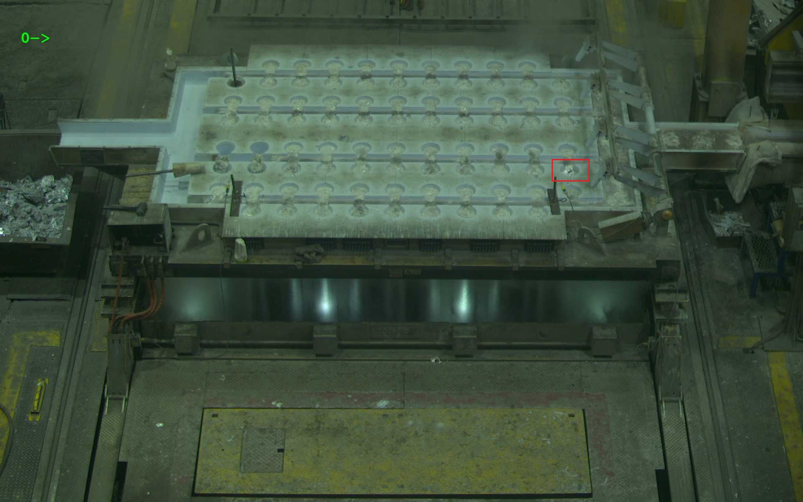

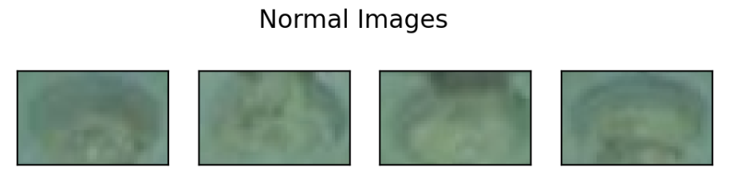
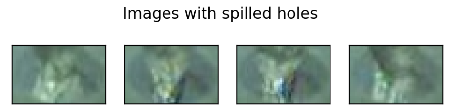

[//]: # (dataset)

[//]: # (├── proliv  # изображения с проливами)

[//]: # (|       ├── 000.jpg)

[//]: # (│       ├── 001.jpg)

[//]: # (│       │   └── ...)

[//]: # (|)

[//]: # (├── test  # тестовая выборка где перемешаны проливы и не_проливы)

[//]: # (│       ├── imgs)

[//]: # (│       │   ├── 000.jpg)

[//]: # (│       │   ├── 001.jpg)

[//]: # (│       │   └── ...)

[//]: # (│       └── test_annotation.txt)

[//]: # (|)

[//]: # (├── train  #  обучающая выборка из не_проливов)

[//]: # (|       ├── 000.jpg)

[//]: # (│       ├── 001.jpg)

[//]: # (│       └── ...)

## План решения

1. Имплементировать или найти автоэкодер.
2. Обучить автоэнкодер на не проливах (dataset\train).

Если через такой автоэнкодер прогнать изображение пролива, то MSE между входным изображением и выходным будет больше, чем если прогнать изображение без пролива. Следовательно, если определить некоторое пороговое значение MSE, можно классифицировать изображение на классы пролив\не_пролив. (MSE между входной картинкой и выходной больше фиксированного порога - пролив).
В качестве loss функции используем MSE (как минимум для baseline).

3. Написать метод классификации лунок в зависимости от порога. Для определения порога используем изображения из dataset\proliv.
4. На изображениях из dataset\test протестировать качество: посчитать True_positive_rate и True_negative_rate (нужно получить более 91% по каждой).

## Решение и результаты

[Ссылка на решение](https://www.kaggle.com/code/anastasiiasemina1/anomaly-detection)

### Эксперимент 1 (Ноутбук с экспериментами приложен)

Обучен автоэнкодер, размерность латентного пространства - 2.

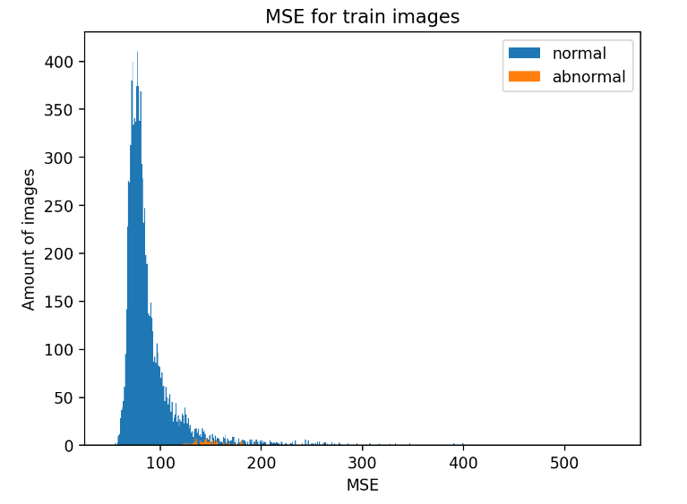

Я пробовала вручную выставлять 2 порога, при левом пороге 135 и правом 215 получились следующие метрики:

**TPR = 0.84, TNR = 0.84**. 

Неплохо, но нужно больше.

Далее я делала подбор левого порога в цикле с шагом 1, я поздно заметила, что проверка качества велась на тестовой выборке (а так считать нечестно), но даже на ней нужные метрики не достигаются:

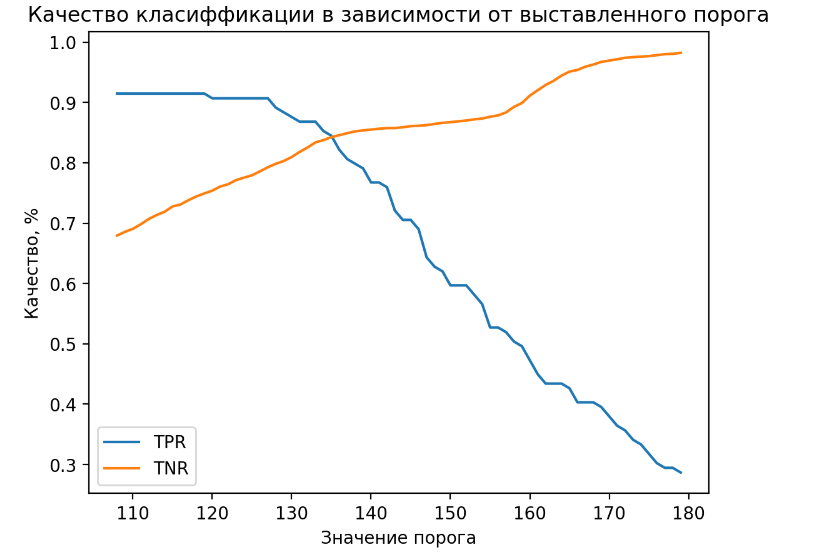

Подбор правого порога с зафиксированным левым:

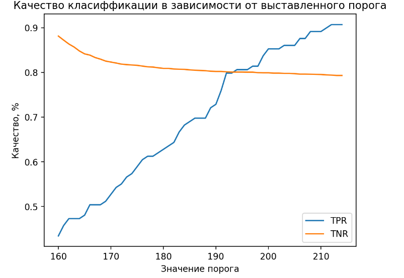
### Эксперимент 2

Еще пробовала обучать вариационный автоэнкодер с размерностью латентного пространства 2 и 100, но там получались примерно такие же распределения MSE и результаты.

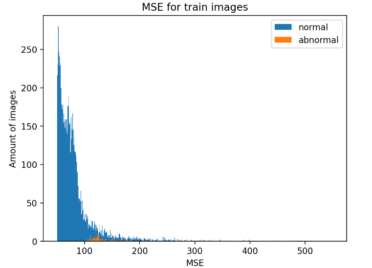

### Эксперимент 3 (Следующие эксперименты проводились на Каггле)

Добавила аугментацию, распределение MSE у нормальных и аномальных изображений стало еще более неразделимо:
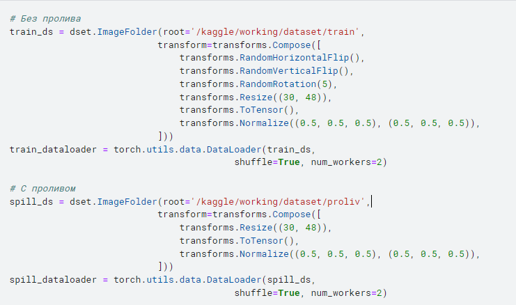
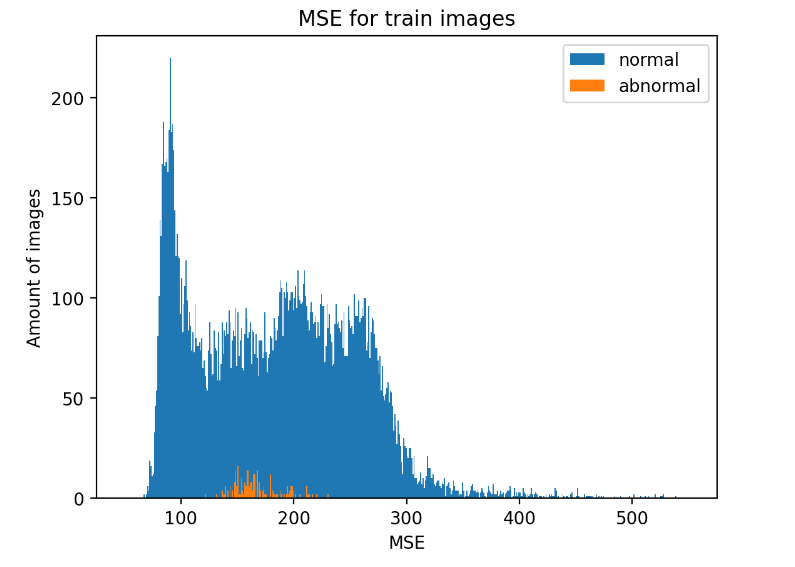

### Эксперимент 4

Поменяла размер изображения, распределение стало еще хуже:
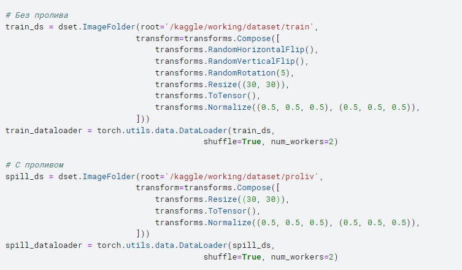
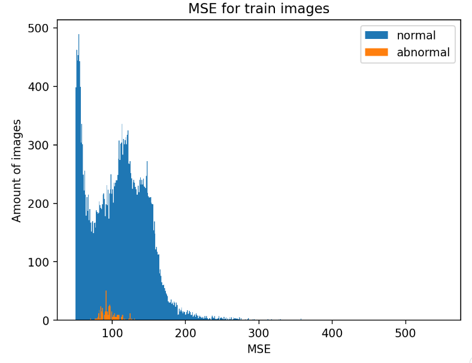

### Эксперимент 5

Взяла другую архитектуру автоэнкодера, изменила размер изображения на 32*32, batch_size=64
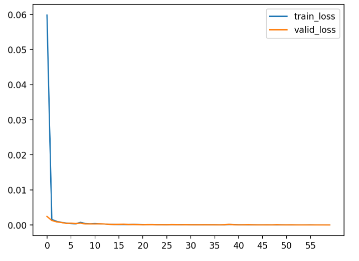
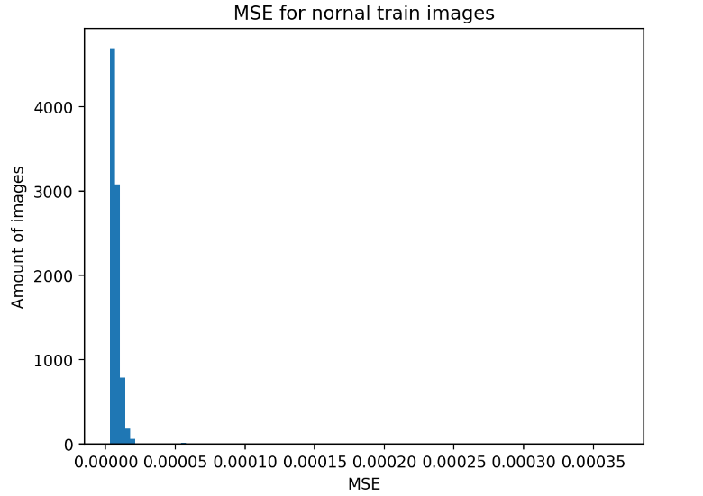
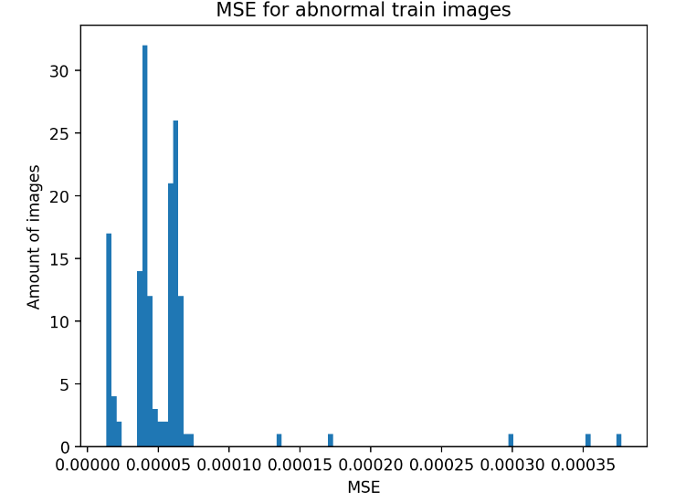

Распределения стали более разделимыми, но метрики не достигают 91%

### Эксперимент 6

Все то же самое, как и в эксперименте 5, только эпох 25, batch_size=128
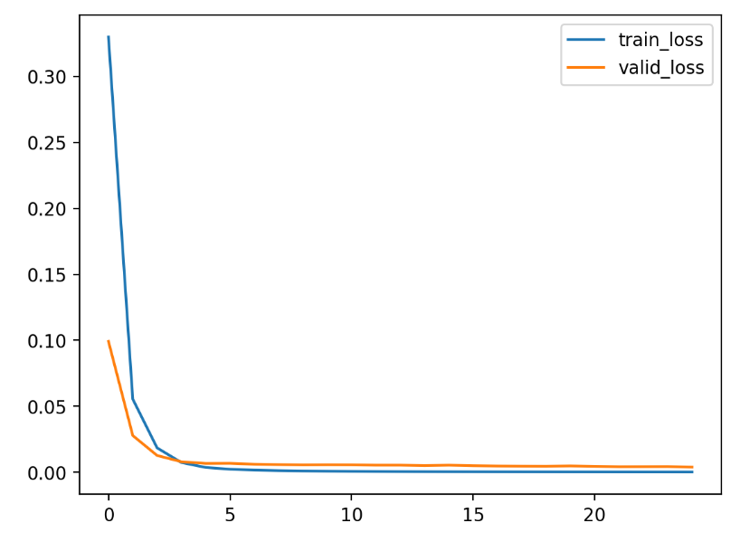
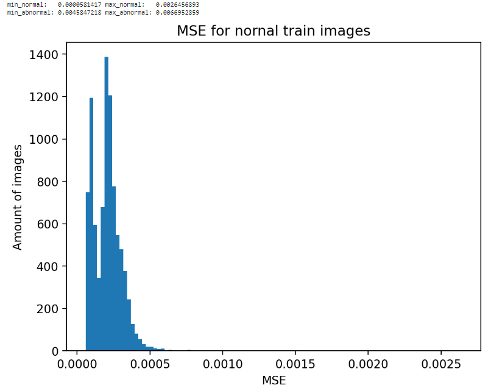
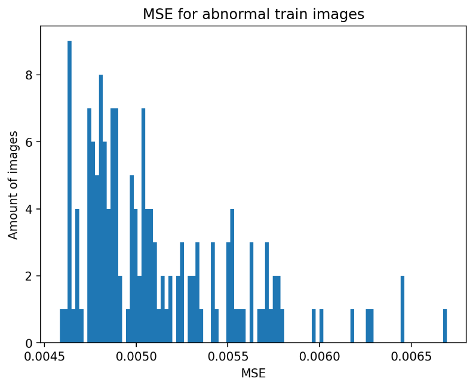
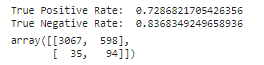

### Эксперимент 7

Еще экспериментировала с лосс-функцией:
- суммировала mse по каждому изображению, а потом делила на размер датасета
- использовала встроенный nn.MSELoss(), суммировала по батчам, а потом делила на количество батчей (график с первой версией автоэнкодера, который взят с лекции):
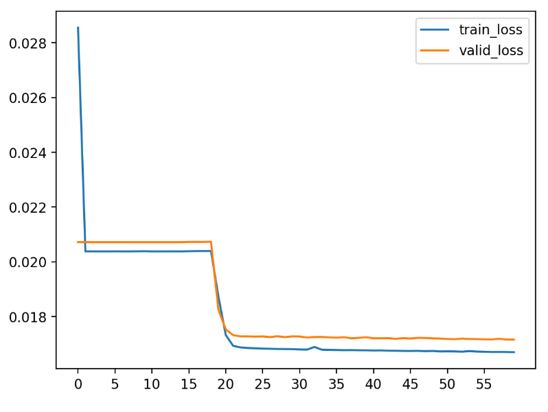

Метрики примерно одинаковые.

## Следующие шаги

Распределение у тестовой выборки видимо совсем другое. За неимением идей, как сделать честное решение (без даталика с тестовой выборки, без установления 2 порогов - верхнего и нижнего) обратилась к Chat-GPT. Из того, что еще можно попробовать:

1. Использование более сложной архитектуры автоэнкодера:
   - Я уже попробовала 3 варианта, кажется, что все-таки дело в разных распределениях тестовой и трейновой выборок.
   
2. Аугментация данных:
   - Можно попробовать еще с шумом и цветом поработать.

3. Использование других метрик оценки:
   - Помимо MSE можно рассмотреть использование других метрик, таких как PSNR (Peak Signal-to-Noise Ratio) или SSIM (Structural Similarity Index), которые могут лучше отражать структурное сходство между изображениями.

4. Регуляризация и оптимизация гиперпараметров:
   - Использование регуляризации (например, L1 или L2) для улучшения обобщающей способности модели. Также можно поэкспериментировать с различными оптимизаторами и скоростями обучения для достижения лучшей сходимости.

5. Применение других методов обнаружения аномалий:
   - Возможно, использование автоэнкодера не является наилучшим способом обнаружения аномалий в данной ситуации. Стоит рассмотреть применение других методов обнаружения аномалий, таких как One-Class SVM, Isolation Forest, или ансамбли моделей.

## Выводы

Я поработала с pytorch, разобралась как писать свои модели, как работать с данными, с батчами, это было очень полезно.
