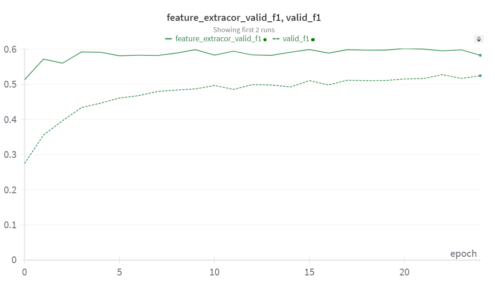

# Многоклассовая классификация с помощью техники Self-supervised learning

Датасет [CIFAR-10](https://www.cs.toronto.edu/~kriz/cifar.html)

[Ссылка на код решения на Каггле](https://www.kaggle.com/anastasiiasemina1/lab-3-cv/)

Для ситуации, когда у нас есть большой датасет, но размечена только его часть, можно использовать технику Self-supervised learning.
Нужно предварительно обучить нашу сеть на датасете без меток, чтобы сеть узнала что-то из самих данных. После этого можно уже обучать на размеченной части. Таким образом, можно повысить производительность решения, избегая маркировки всего набора данных.

## Эксперимент 1
100% датасета
#### График лосс-функции в процессе обучения:

#### График метрик на валидационной выборке во время обучения:
|  |  |
|-------------------------|-------------------------|
|  |      |

## Выводы

У модели с предобученным feature extracor лосс ниже, а метрики лучше, к тому же она быстрее выходит на плато. 

